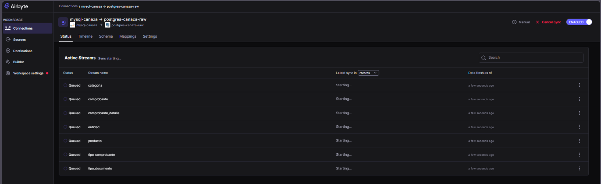
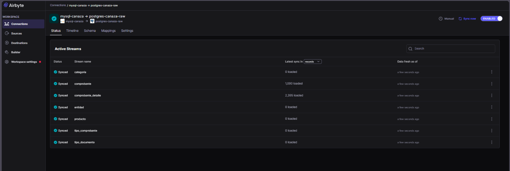

# Sincronización Airbyte

## Configuración de la conexión

- Connection name: mysql-canaza → postgres-canaza-raw
- Schedule type: Manual
- Destination Namespace: Destination-defined

## Tipo de carga

La réplica es **Full Refresh / Overwrite**: en cada sincronización Airbyte
vuelve a leer las 7 tablas completas desde MySQL y sobrescribe el schema
`raw` en PostgreSQL. No es una carga incremental ni usa CDC (Change Data
Capture); esto se documenta como limitación en
[Sustentación técnica](../sustentacion.md).

## Ejecutar sincronización

1. Abrir http://localhost:8010
2. Ir a la conexión mysql-canaza → postgres-canaza-raw
3. Hacer clic en **Sync now**
4. Esperar que todas las tablas digan **Synced**

## Evidencia de ejecución

Sincronización en curso — los 7 streams en estado `Queued`/`Starting`:



Sincronización completada — todos los streams en estado `Synced`, con el
detalle de registros cargados por tabla:



## Verificar en PostgreSQL

```sql
\dt raw.*
SELECT COUNT(*) FROM raw.comprobante;
SELECT COUNT(*) FROM raw.comprobante_detalle;
```

Con las 7 tablas replicadas en el schema `raw`, el siguiente paso es la
transformación con dbt — ver [Estructura del proyecto dbt](../dbt/estructura.md).
