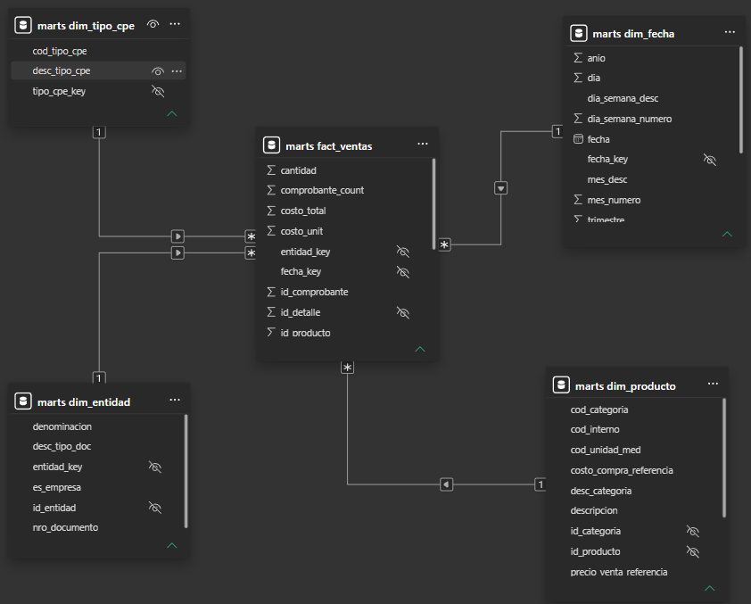

# Modelo Dimensional

## Esquema estrella

El DataMart de Canaza se modeló como un **esquema estrella** (metodología
Kimball, bottom-up), con `fact_ventas` al centro y 4 dimensiones conectadas
directamente a ella:

| Tabla | Tipo | Descripción | Clave principal | KPI soportado |
|-------|------|--------------|--------------------|------------------|
| dim_fecha | Dimensión | Fechas de emisión con atributos: día, mes, mes_desc, trimestre, año, día_semana_desc | `fecha_key` (YYYYMMDD) | KPI 1, KPI 2, Comparativos |
| dim_entidad | Dimensión | Clientes y empresas — nro_documento, denominacion, desc_tipo_doc, es_empresa (true=RUC, false=DNI) | `entidad_key` | Todos los KPIs |
| dim_producto | Dimensión | Productos con categoría denormalizada — descripcion, costo_compra_referencia, precio_venta_referencia, desc_categoria | `producto_key` | KPI 3, KPI 4 |
| dim_tipo_cpe | Dimensión | Tipo de comprobante — Factura (01), Boleta (03), Nota Crédito (07), Nota Débito (08) | `tipo_cpe_key` | Filtro tipo doc |
| fact_ventas | Hecho | Líneas de comprobante: cantidad, precio_unit_sinigv, costo_unit, venta_bruta, venta_neta, costo_total, margen_bruto, pct_margen_bruto, comprobante_count | `fact_venta_key` (dbt) / `id_detalle` (trazabilidad) | Todos los KPIs |

`fact_ventas` cubre el período 2023–2026 con datos reales de Distribuciones
Canaza E.I.R.L.

## ¿Por qué se eligió este modelo dimensional?

Se eligió un esquema estrella siguiendo la metodología Kimball (bottom-up)
porque Canaza tiene un único proceso analítico central: las ventas por línea
de comprobante. `fact_ventas` al centro con 4 dimensiones (fecha, entidad,
producto, tipo_cpe) cubre todos los KPIs definidos en la Unidad 1.

Se optó por una sola `dim_entidad` en vez de `dim_cliente` y `dim_vendedor`
separadas, porque en Canaza no hay vendedores registrados, solo clientes.
`dim_producto` se denormalizó con categoría porque solo hay un nivel
jerárquico — no se justifica una `dim_categoria` separada.

## Reglas de negocio aplicadas

Ver el detalle completo en [Modelos marts de dbt](../dbt/marts.md#reglas-de-negocio-aplicadas).

Las dimensiones se documentan en detalle en [Dimensiones](dimensiones.md) y el
hecho en [Tabla de hechos](hechos.md).
