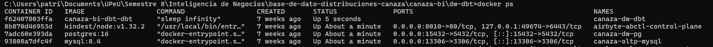

# Estructura del Proyecto dbt

## Contenedor

- Imagen: Python 3.11-slim + dbt-core 1.11.8 + dbt-postgres 1.10.0
- Contenedor: `canaza-dw-dbt`
- Proyecto: `canaza_bi`

## Levantar el contenedor

```powershell
cd D:\261bi\canaza-bi\dw-dbt
docker compose up -d --build
docker exec -it canaza-dw-dbt bash
cd /usr/app/canaza_bi
```

Verificación de los 3 contenedores activos (MySQL, PostgreSQL y dbt) desde la
carpeta `dw-dbt`:



## Archivos clave

| Archivo | Propósito |
|---------|-----------|
| `dbt_project.yml` | Configuración del proyecto |
| `.dbt/profiles.yml` | Conexión a PostgreSQL |
| `macros/generate_schema_name.sql` | Evita concatenar `marts_staging` en los nombres de schema generados |
| `models/staging/*.sql` | 7 vistas de limpieza |
| `models/marts/*.sql` | 5 tablas del DataMart |
| `models/marts/marts.yml` | 33 tests de calidad |

## Capas del proyecto

dbt organiza la transformación en tres capas, equivalentes al patrón
Bronze/Silver/Gold usado en arquitecturas de datos modernas:

| Capa | Equivalencia | Propósito | Evidencia |
|------|---------------|-----------|-----------|
| raw | Bronze | Datos crudos replicados desde el OLTP vía Airbyte — sin transformaciones, estructura 1:1 con el origen | `\dt raw.*` en PostgreSQL — 7 tablas |
| staging | Silver | Vistas dbt limpias, renombradas y estandarizadas — filtro `anulado = false` — `LEFT JOIN categoria` en `stg_producto` | `\dv staging.*` — 7 vistas `stg_*` |
| marts | Gold | Tablas dbt con dimensiones y hechos del DataMart — claves sustitutas — métricas calculadas por línea de detalle | `\dt marts.*` — 5 tablas: `dim_*` + `fact_ventas` |

Detalle de cada capa: [Modelos staging](staging.md), [Modelos marts](marts.md)
y los [tests de calidad](tests.md) que validan el resultado final.
