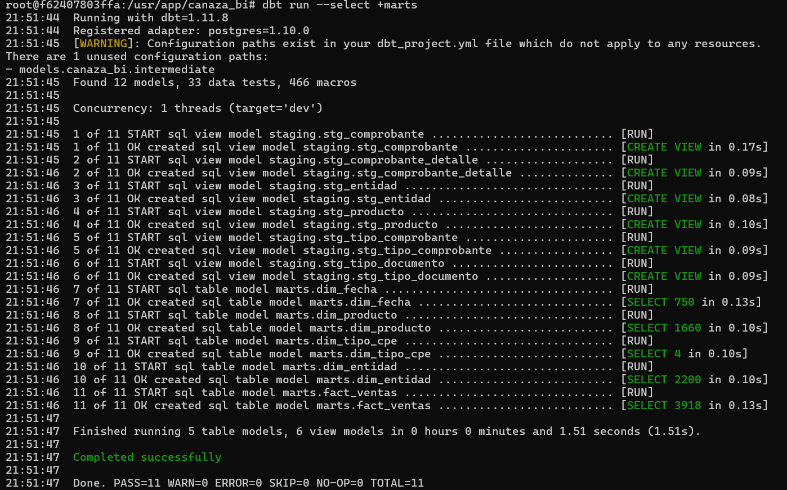

# Modelos Marts

Los modelos marts materializan tablas físicas en el schema `marts`: son las 4
dimensiones y la tabla de hechos que forman el esquema estrella del
DataMart.

## Ejecutar

```bash
dbt run --select +marts
```

## Modelos y transformación aplicada

| Modelo | Capa | Fuente | Transformación aplicada | Resultado |
|--------|------|--------|---------------------------|-----------|
| dim_entidad | marts | stg_entidad + stg_tipo_documento | `es_empresa = true` si `cod_tipo_doc = '6'` (RUC) | 2,200 filas |
| dim_producto | marts | stg_producto | Denormaliza categoría — costo y precio de referencia | 1,660 filas |
| dim_fecha | marts | stg_comprobante (fechas únicas) | `fecha_key = YYYYMMDD` — extrae día, mes, trimestre, año | 219+ filas |
| dim_tipo_cpe | marts | stg_tipo_comprobante | `dense_rank()` para `tipo_cpe_key` | 4 filas |
| fact_ventas | marts | stg_comprobante + stg_comprobante_detalle + dims | Grano: `id_detalle` — calcula `venta_bruta`, `venta_neta`, `costo_total`, `margen_bruto`, `pct_margen_bruto` | 1,523+ filas |

## Grano de fact_ventas

**Una fila por `id_detalle`** (no por `id_comprobante` + `id_producto`). Esto
es porque en Canaza el mismo producto puede aparecer dos veces en un
comprobante con precios distintos — ver el hallazgo de calidad completo en
[Tests dbt](tests.md#hallazgo-de-calidad-grano-de-fact_ventas).

## Reglas de negocio aplicadas

| Regla | Tabla / campo | Descripción | KPI afectado |
|-------|----------------|--------------|----------------|
| Excluir comprobantes anulados | `stg_comprobante.anulado` | `WHERE anulado = false` en PostgreSQL (equivale a `anulado = 0` en MySQL). Solo se analizan ventas válidas | Todos los KPIs |
| Grano por id_detalle | `fact_ventas.id_detalle` | El mismo producto puede aparecer dos veces en un comprobante con precios distintos. `id_detalle` garantiza unicidad | Conteo de líneas |
| Clasificación tipo cliente | `dim_entidad.es_empresa` | `es_empresa = true` si `cod_tipo_doc = '6'` (RUC). Permite filtrar empresas vs personas naturales | Análisis de clientes |
| Categoría denormalizada | `dim_producto.desc_categoria` | La categoría se incorpora directamente en `dim_producto`. No existe `dim_categoria` separada porque Canaza tiene solo un nivel jerárquico | KPI 3, KPI 4 |

## Evidencia de ejecución

```text
dbt run --select +marts
Found 12 models, 33 data tests, 466 macros
...
7 of 11 START sql table model marts.dim_fecha ........... [RUN]
7 of 11 OK created sql table model marts.dim_fecha ........ [SELECT 750 in 0.13s]
8 of 11 OK created sql table model marts.dim_producto ..... [SELECT 1660 in 0.10s]
9 of 11 OK created sql table model marts.dim_tipo_cpe ..... [SELECT 4 in 0.10s]
10 of 11 OK created sql table model marts.dim_entidad ...... [SELECT 2200 in 0.10s]
11 of 11 OK created sql table model marts.fact_ventas ...... [SELECT 3918 in 0.13s]
Completed successfully
Done. PASS=11 WARN=0 ERROR=0 SKIP=0 NO-OP=0 TOTAL=11
```



Con las tablas físicas creadas, el modelo dimensional completo se documenta en
[DataMart — Modelo dimensional](../datamart/modelo.md), y la calidad se valida
en los [tests de dbt](tests.md).
