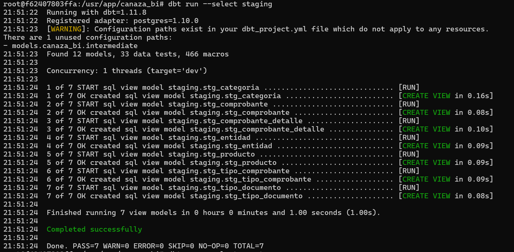

# Modelos Staging

Los modelos staging leen desde el schema `raw` y producen vistas limpias en el
schema `staging`. Son 7 vistas, todas con materialización `view` (no ocupan
espacio adicional, se recalculan en cada consulta).

## Ejecutar

```bash
dbt run --select staging
```

## Modelos y transformación aplicada

| Modelo | Capa | Fuente | Transformación aplicada | Resultado |
|--------|------|--------|---------------------------|-----------|
| stg_comprobante | staging | raw.comprobante | `WHERE anulado = false` (boolean en PostgreSQL) — selección de campos clave | Vista sin anulados |
| stg_comprobante_detalle | staging | raw.comprobante_detalle | Selección directa — conserva `id_detalle` como grano | Vista con grano correcto |
| stg_producto | staging | raw.producto + raw.categoria | `LEFT JOIN categoria` — enriquece con `desc_categoria` y `cod_categoria` | Vista con categoría |
| stg_entidad | staging | raw.entidad | Selección de campos clave para `dim_entidad` | Vista de clientes |
| stg_tipo_comprobante | staging | raw.tipo_comprobante | Selección directa | Vista de tipos de comprobante |
| stg_tipo_documento | staging | raw.tipo_documento | Selección directa | Vista de tipos de documento |
| stg_categoria | staging | raw.categoria | Selección directa | Vista de categorías |

## Evidencia de ejecución

```text
dbt run --select staging
Found 12 models, 33 data tests, 466 macros
...
Finished running 7 view models in 0 hours 0 minutes and 1.00 seconds (1.00s)
Completed successfully
Done. PASS=7 WARN=0 ERROR=0 SKIP=0 NO-OP=0 TOTAL=7
```



## Hallazgo de calidad — boolean vs TINYINT

Al migrar de MySQL a PostgreSQL vía Airbyte, el campo `anulado` se convirtió
de **TINYINT** (0/1) en MySQL a **boolean** (true/false) en PostgreSQL. El
modelo `stg_comprobante` fallaba con error de tipos al usar `WHERE anulado =
0`. Se corrigió a `WHERE anulado = false`. Este es el hallazgo de calidad más
relevante del proyecto y evidencia la importancia de validar tipos de datos
entre tecnologías en un pipeline de ingesta — ver detalle ampliado en
[Calidad de datos](../validacion/calidad.md).

Con las 7 vistas de staging listas, el siguiente paso es construir las
[tablas marts](marts.md) (dimensiones y hecho).
