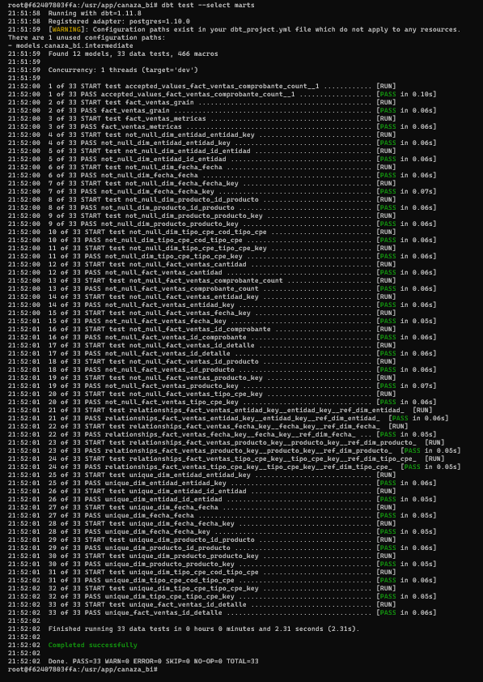

# Tests dbt

## Ejecutar

```bash
dbt test --select marts
```

## Resultado

**PASS=33 WARN=0 ERROR=0 SKIP=0 NO-OP=0 TOTAL=33**

```text
dbt test --select marts
Found 12 models, 33 data tests, 466 macros
...
Finished running 33 data tests in 0 hours 0 minutes and 2.31 seconds (2.31s)
Completed successfully
Done. PASS=33 WARN=0 ERROR=0 SKIP=0 NO-OP=0 TOTAL=33
```



## Tipos de tests

| Tipo | Qué valida |
|------|------------|
| not_null | Campos críticos del hecho y de las dimensiones sin valores nulos |
| unique | Claves sustitutas (`entidad_key`, `producto_key`, `fecha_key`, `tipo_cpe_key`) sin duplicados |
| relationships | FK válidas entre `fact_ventas` y las 4 dimensiones |
| accepted_values | `comprobante_count = 1` en cada línea de `fact_ventas` |
| Singular (grano) | Sin duplicados por `id_detalle` en `fact_ventas` |
| Singular (métricas) | Cálculos correctos de `venta_neta`, `costo_total` y `margen_bruto` |

## Controles de calidad aplicados

| Control | Tabla / campo | Regla esperada | Resultado | Estado |
|---------|----------------|-------------------|-----------|--------|
| Completitud | `fact_ventas.id_comprobante`, `id_producto`, `cantidad` | Sin nulos en campos críticos del hecho | 0 nulos — test `not_null` PASS | OK |
| Unicidad | `dim_entidad.entidad_key`, `dim_producto.producto_key`, `dim_fecha.fecha_key` | Claves sustitutas únicas por dimensión | PASS en todos los tests `unique` de dbt | OK |
| Integridad referencial | `fact_ventas` → `dim_entidad`, `dim_producto`, `dim_fecha`, `dim_tipo_cpe` | FK válidas (test `relationships` de dbt) | 4 tests `relationships` = PASS | OK |
| Consistencia | `fact_ventas.venta_neta` vs OLTP `comprobante_detalle.subtotal_sinigv` | Ventas DM = Ventas OLTP (solo `anulado = false`) | S/ 1,369,313.54 en MySQL y PostgreSQL | OK |
| Grano correcto | `fact_ventas.id_detalle` | Sin duplicados por `id_detalle` | 0 duplicados — test singular PASS | OK |
| Exclusión anulados | `stg_comprobante.anulado` | `WHERE anulado = false` en PostgreSQL | Solo comprobantes válidos en análisis | OK |

## Hallazgo de calidad — grano de fact_ventas

Durante la validación con `dbt test` se detectaron 11 combinaciones de
`id_comprobante` + `id_producto` duplicadas. Se confirmó que en Canaza es
válido que un mismo comprobante tenga el mismo producto dos veces con precios
distintos. El grano correcto es `id_detalle` (único en el OLTP). Se corrigió
el test de grano y todos los tests restantes pasaron sin error.

## Reglas de gobierno

| Elemento | Regla / definición | Responsable |
|----------|----------------------|--------------|
| Definición de KPI | Los 4 KPIs (Cumplimiento, Variación, Margen, Volumen Gastos) están definidos en el brief de la U1 con fórmulas, escalas y usuarios aprobados | Gerente de Canaza + equipo BI |
| Fuente oficial | Los datos provienen exclusivamente de la base MySQL `canaza_oltp`, alimentada por comprobantes electrónicos SUNAT | Sistema SUNAT — Distribuciones Canaza |
| Frecuencia de actualización | Sincronización manual con Airbyte + `dbt run` para actualizar el DataMart. Recomendado: mensual o ante cierre de período | Equipo BI — Machaca / Apaza |
| Criterio de calidad | Los KPIs se validan comparando SQL DataMart vs Power BI. La diferencia aceptable es S/ 0.00 en montos y 0% en ratios | Equipo BI |

Estos resultados se complementan con la
[conciliación SQL vs Power BI](../validacion/sql_vs_pbi.md), que verifica los
mismos valores desde el lado del modelo semántico.
