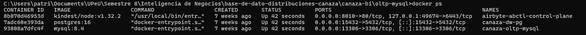
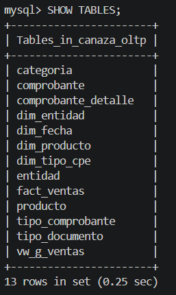
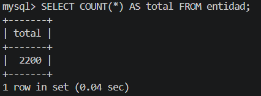
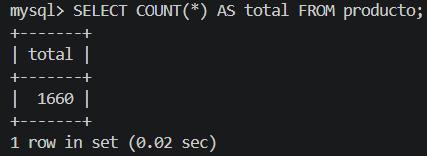
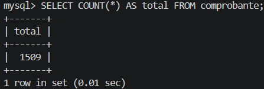
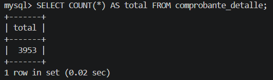
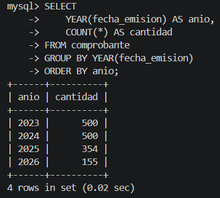

# Descripción del OLTP

La base transaccional `canaza_oltp` en MySQL 8.4 contiene los datos reales de
Distribuciones Canaza exportados del sistema SUNAT. Es la única fuente oficial
de datos del proyecto: todo el pipeline (Airbyte, dbt, Power BI) parte de esta
base.

## Tablas principales

| Tabla | Registros | Descripción | Campos principales | Uso analítico |
|-------|-----------|-------------|----------------------|-----------------|
| entidad | 2,200 | Clientes RUC y DNI | id_entidad, cod_tipo_doc, nro_documento, denominacion | Fuente de `dim_entidad` — clasificación empresa/persona |
| producto | 1,660 | Catálogo con costos y precios | id_producto, cod_interno, descripcion, costo_compra, precio_venta, id_categoria | Fuente de `dim_producto` — cálculo de margen bruto |
| comprobante | ~1,500 | Facturas FQQ1 y Boletas BQQ1 | id_comprobante, fecha_emision, cod_tipo_cpe, id_entidad, mto_total, anulado | Fuente de `fact_ventas` y `dim_fecha` — filtro `anulado = false` |
| comprobante_detalle | ~3,900 | Líneas de venta por producto | id_detalle, id_comprobante, id_producto, cantidad, precio_unit_sinigv, costo_unit, subtotal_sinigv | Grano del hecho: una fila por `id_detalle` |
| categoria | 3 | SIN CATEGORÍA, Archivador, Papeles | id_categoria, cod_categoria, desc_categoria | Denormalizada en `dim_producto` |
| tipo_comprobante | 4 | Factura, Boleta, Nota Crédito, Nota Débito | cod_tipo_cpe, desc_tipo_cpe | Fuente de `dim_tipo_cpe` |
| tipo_documento | 7 | RUC, DNI y otros | cod_tipo_doc, desc_tipo_doc | Enriquece `dim_entidad` con `desc_tipo_doc` y flag `es_empresa` |

## Período de datos

- Datos reales: abril 2025 — abril 2026
- Datos ficticios (estacionalidad realista): enero 2023 — diciembre 2024

## Contenedor Docker

- Imagen: MySQL 8.4
- Contenedor: `canaza-oltp-mysql`
- Puerto: 13306
- Base: `canaza_oltp`
- Usuario: root / Contraseña: root

## Evidencia del origen

Verificación del contenedor activo:

Tablas existentes en `canaza_oltp` (incluye las tablas auxiliares del DataMart
manual creadas en la Sesión 6):

Conteo de registros por tabla clave:

Distribución de comprobantes por año, evidenciando la cobertura del período
2023–2026:

