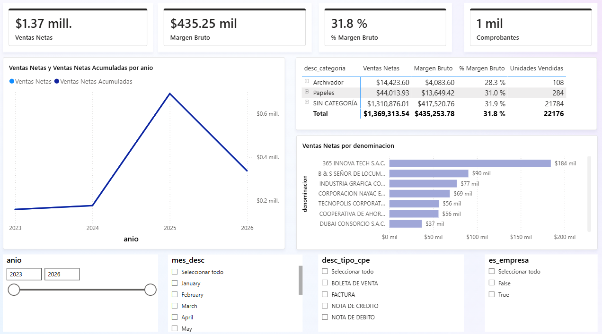
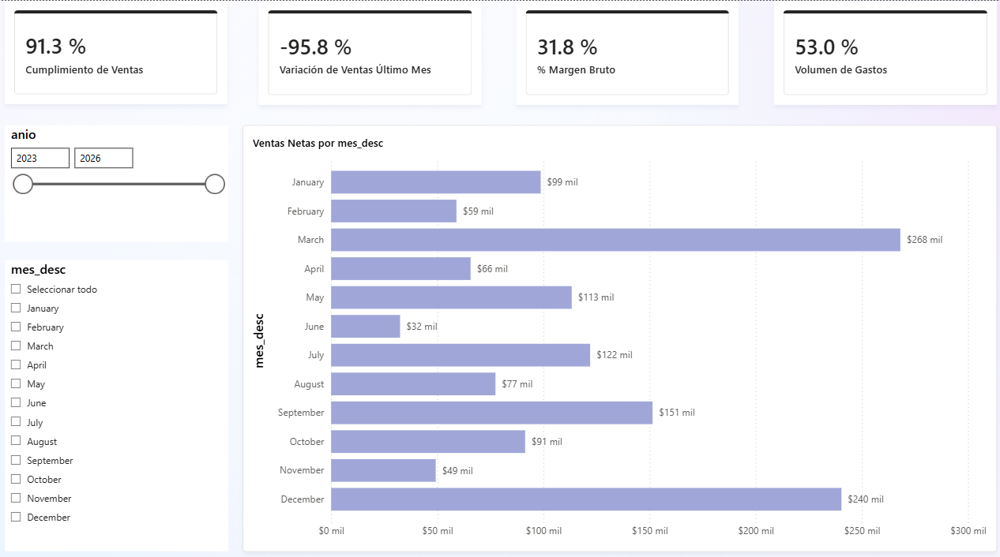
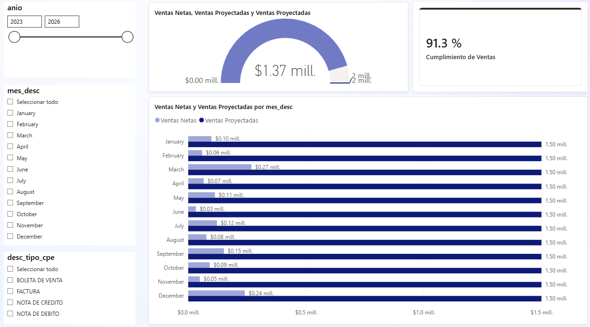
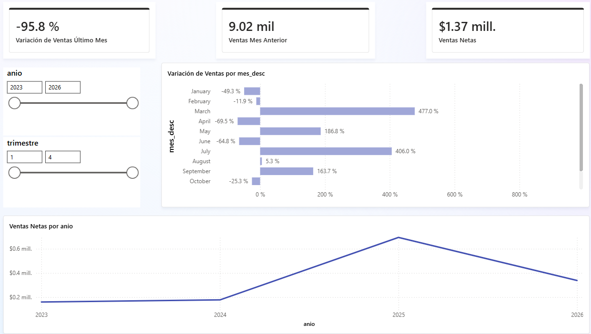
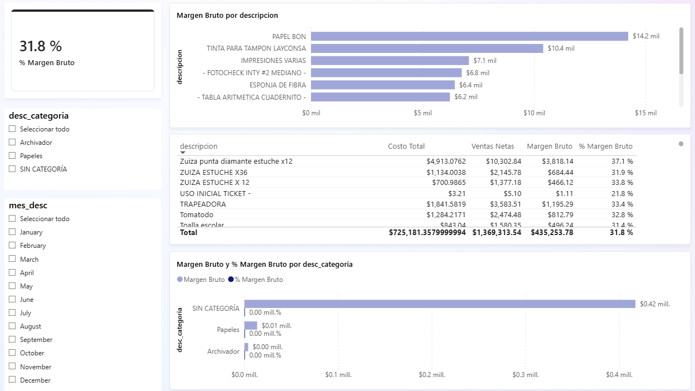
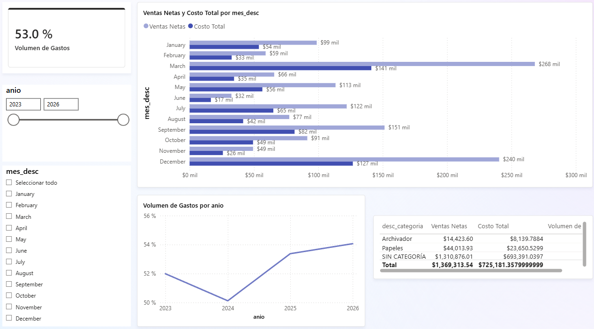
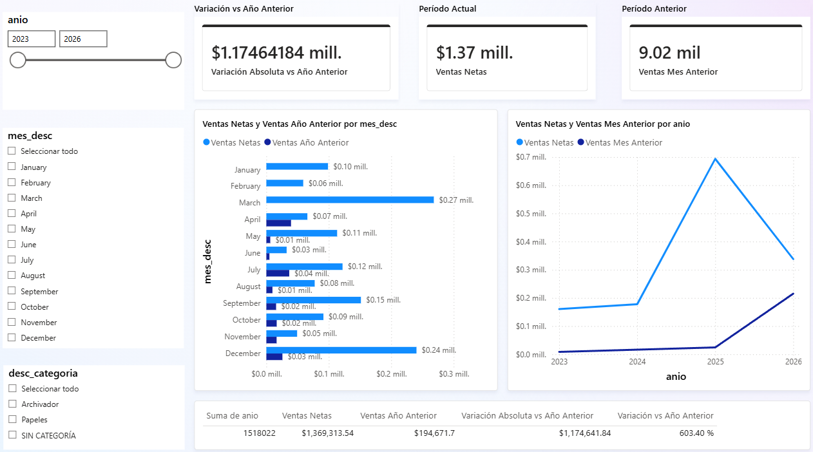

# Dashboard Interactivo

El dashboard tiene 7 páginas construidas sobre el modelo semántico, con
segmentadores de año, mes, tipo de comprobante y categoría que permiten al
gerente filtrar el análisis sin tocar SQL ni Power Query.

Archivo: `canazaPBI v1.pbix` en la carpeta `powerbi/` del repositorio.

## Páginas del dashboard

| Página | Objetivo | Visuales principales | Filtros |
|--------|----------|--------------------------|---------|
| Análisis General | Vista panorámica de ventas 2023–2026 | 4 tarjetas (Ventas Netas, Margen Bruto, % Margen, Comprobantes) + líneas acumuladas + tabla por categoría + barras top clientes | Año, mes, tipo CPE, es_empresa |
| Resumen General | Vista ejecutiva con los 4 KPIs del proyecto | 4 tarjetas KPI (Cumplimiento 91.3%, Variación -95.8%, Margen 31.8%, Volumen Gastos 53.0%) + barras ventas por mes | Año, mes_desc |
| KPI 1 — Cumplimiento | ¿Se cumple la meta de ventas? | Medidor Gauge (91.3% de S/ 1,500,000) + barras real vs meta por mes | Año, mes, tipo CPE |
| KPI 2 — Variación | ¿Crece o cae el negocio? | Tarjetas (Variación, Ventas Netas, Mes Anterior) + líneas tendencia + barras variación por mes | Año, trimestre |
| KPI 3 — Margen Bruto | ¿Cuánto gana la empresa? | Tarjeta 31.8% + barras top 10 productos por margen + tabla detalle + barras por categoría | Categoría, mes |
| KPI 4 — Volumen Gastos | ¿Qué % de ingresos se va en costos? | Tarjeta 53.0% + líneas volumen por mes + tabla por categoría + barras ventas vs costos | Año, mes |
| Comparativos | Comparar períodos — cumple rúbrica U3 | Barras actual vs año anterior por mes + líneas actual vs mes anterior + tabla KPI variación por año y categoría | Año, categoría |

## Capturas

### Página Análisis General

### Página Resumen General

### KPI 1 — Cumplimiento de Ventas

### KPI 2 — Variación de Ventas

### KPI 3 — Margen Bruto

### KPI 4 — Volumen de Gastos

### Página Comparativos

## Comparativos y KPIs obligatorios del dashboard

| Actividad obligatoria | Objetivo | Evidencia en dashboard |
|--------------------------|----------|----------------------------|
| Comparativo período actual vs mismo período año anterior | Comparar ventas del mes seleccionado contra el mismo mes del año anterior | Gráfico de barras agrupadas por mes: [Ventas Netas] vs [Ventas Año Anterior] — página Comparativos — segmentador de año |
| Comparativo período actual vs período anterior | Comparar ventas del mes actual contra el mes inmediatamente anterior | Gráfico de líneas con [Ventas Netas] y [Ventas Mes Anterior] — tarjetas comparativas — página KPI 2 y Comparativos |
| Tabla KPI de variación por dimensión de negocio | Mostrar variación absoluta y porcentual por año y categoría | Tabla con dim_fecha[anio], [Ventas Netas], [Ventas Año Anterior], [Variación Absoluta vs Año Anterior], [Variación vs Año Anterior] — página Comparativos — segmentador de categoría |

## Resultados de KPIs

| KPI | Resultado | Interpretación |
|-----|-----------|--------------------|
| Cumplimiento de Ventas | 91.3% | Zona Buena (>90%) |
| Margen Bruto | 31.8% | Zona Buena (>30%) |
| Volumen de Gastos | 53.0% | Zona Eficiente (<60%) |
| Variación de Ventas (último mes) | -95.8% | Mes parcial / en curso, ver [KPIs principales](../negocio/kpis.md) |

La interpretación de negocio de estos resultados está en
[Hallazgos y decisión recomendada](../negocio/hallazgos.md), y la validación
numérica que sustenta cada cifra en [Validación SQL vs Power BI](../validacion/sql_vs_pbi.md).
