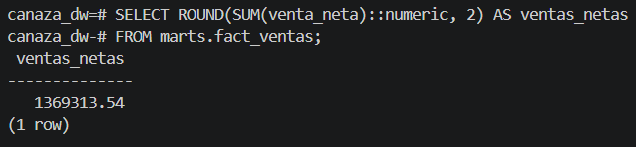
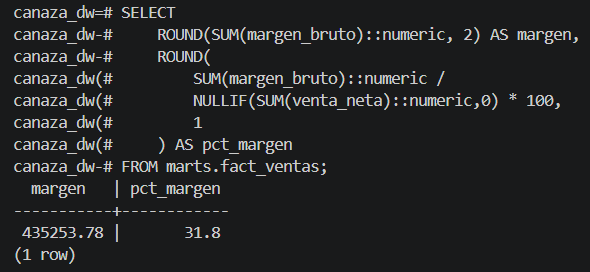
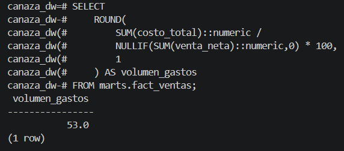
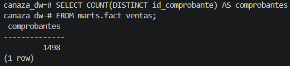

# Validación SQL vs Power BI

La validación se hizo en tres niveles: (1) los 33 tests automáticos de dbt
(ver [Tests dbt](../dbt/tests.md)), (2) la conciliación directa entre el SQL
del DataMart y las medidas de Power BI documentada en esta página, y (3) la
inspección visual de cada tarjeta del dashboard contra el resultado SQL.

## Conciliación SQL vs Power BI

| KPI | Resultado SQL DataMart | Resultado Power BI | Diferencia | Estado |
|-----|----------------------------|------------------------|------------|--------|
| Ventas Netas totales | S/ 1,369,313.54 | S/ 1,369,313.54 | S/ 0.00 | Correcto |
| Margen Bruto total | S/ 435,253.78 | S/ 435,253 | ~S/ 0.00 | Correcto |
| % Margen Bruto | 31.8% | 31.8% | 0% | Correcto |
| Volumen de Gastos | 53.0% | 53.0% | 0% | Correcto |
| Comprobantes distintos | 1498 | 1498 | 0 | Correcto |
| Cumplimiento de Ventas | 91.3% | 91.3% | 0% | Correcto |

## Consultas de validación y evidencia

```sql
-- Ventas netas totales en el DataMart
SELECT ROUND(SUM(venta_neta)::numeric, 2) AS ventas_netas
FROM marts.fact_ventas;
-- Resultado: S/ 1,369,313.54
```



```sql
SELECT ROUND(SUM(margen_bruto)::numeric, 2) AS margen,
       ROUND(SUM(margen_bruto)::numeric / NULLIF(SUM(venta_neta)::numeric,0) * 100, 1) AS pct_margen
FROM marts.fact_ventas;
-- Resultado: S/ 435,253.78 — 31.8%
```



```sql
SELECT ROUND(SUM(costo_total)::numeric / NULLIF(SUM(venta_neta)::numeric,0) * 100, 1) AS volumen_gastos
FROM marts.fact_ventas;
-- Resultado: 53.0%
```



```sql
SELECT COUNT(DISTINCT id_comprobante) AS comprobantes
FROM marts.fact_ventas;
-- Resultado: 1498
```



## Validación visual contra el dashboard

Cada uno de estos cuatro resultados SQL se puede confirmar directamente en
las tarjetas del dashboard, sin filtros aplicados:

- Ventas Netas (S/ 1.37 mill.) → tarjeta en [Análisis General](../powerbi/dashboard.md#pagina-analisis-general)
- % Margen Bruto (31.8%) → tarjeta en [KPI 3 — Margen Bruto](../powerbi/dashboard.md#kpi-3-margen-bruto)
- Volumen de Gastos (53.0%) → tarjeta en [KPI 4 — Volumen de Gastos](../powerbi/dashboard.md#kpi-4-volumen-de-gastos)
- Cumplimiento de Ventas (91.3%) → medidor Gauge en [KPI 1 — Cumplimiento](../powerbi/dashboard.md#kpi-1-cumplimiento-de-ventas)

## Trazabilidad fuente → modelo → KPI → dashboard

| KPI | Fuente OLTP | Capa raw | Modelo staging | Tabla DataMart | Medida BI | Visual |
|-----|----------------|----------|--------------------|---------------------|-----------|--------|
| Ventas Netas | comprobante_detalle.subtotal_sinigv | raw.comprobante_detalle | stg_comprobante_detalle | fact_ventas.venta_neta | SUM(venta_neta) | Tarjetas, líneas, barras |
| Margen Bruto | comprobante_detalle (precio − costo) | raw.comprobante_detalle | stg_comprobante_detalle | fact_ventas.margen_bruto | SUM(margen_bruto) | KPI 3 — top productos |
| % Margen Bruto | Derivado de precio y costo | raw.comprobante_detalle | stg_comprobante_detalle | fact_ventas.pct_margen_bruto | DIVIDE([MB],[VN]) | Tarjeta KPI 3 |
| Volumen Gastos | comprobante_detalle.costo_unit × cantidad | raw.comprobante_detalle | stg_comprobante_detalle | fact_ventas.costo_total | DIVIDE([CT],[VN]) | KPI 4 — líneas |
| Cumplimiento | Derivado de comprobante.mto_total | raw.comprobante | stg_comprobante | fact_ventas.venta_neta | DIVIDE([VN], 1500000) | KPI 1 — Gauge |
| Variación | Derivado de fecha_emision por mes | raw.comprobante | stg_comprobante → dim_fecha | fact_ventas + dim_fecha | VAR/FILTER por mes | KPI 2 — barras |
| Vs Año Anterior | Derivado de fecha_emision por año | raw.comprobante | stg_comprobante → dim_fecha | fact_ventas + dim_fecha | CALCULATE año-1 | Comparativos |

Esta tabla resume, para cada KPI, todo el recorrido del dato desde la columna
exacta del OLTP hasta el visual final del dashboard — la base de la
trazabilidad fuente-modelo-KPI-dashboard exigida por la rúbrica del curso.
